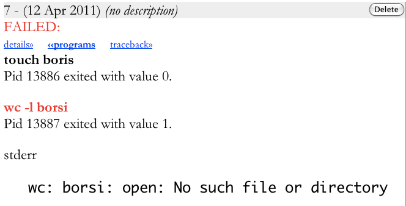
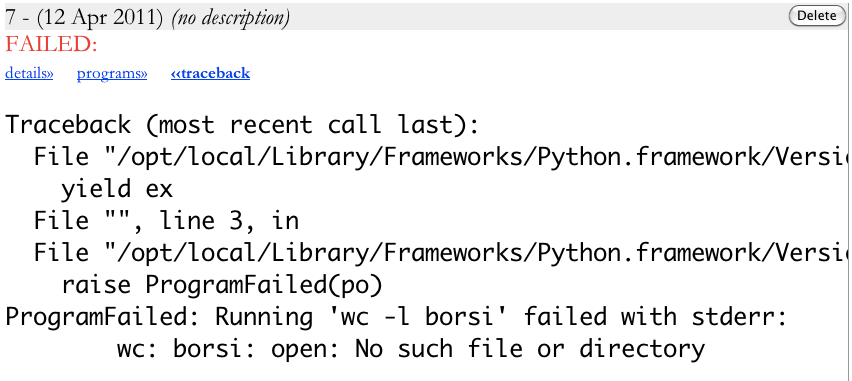

Tutorial
========

What is bein?
-------------

Bein is a Python library.  Beyond that we have had trouble explaining Bein in a few words.  The best way to understand it is to work through a nontrivial example, as this tutorial does.

As a rough overview, Bein can help you if you

* analyze lots of data, and the analyses share many common elements, but the analyses are sufficiently different that small tweaks and if statements in a single script will not suffice.
* have from two to a hundred files that must analyzed in the same way, and you need to keep track of which results came from which file.
* need to interleave computations with calls to external programs in your analyses.

If you have thousands of files to be analyzed in the same way, you would be better served by systems like Galaxy and OpenBIS.  For running a couple, quick commands on a single file, the Unix shell remains the best tool.  If you are running simulations, and are therefore not concerned with external programs or tracking lots of files, we recommend you look at Sumatra; but for many people, including most bioinformaticists, Bein hits a sweet spot.

Installation
------------

Bein is distributed as two packages: ``bein`` and ``bein_htminilims``.  The package ``bein`` contains the core logic and a library of utilities.  It depends on Python >= 2.5 and SQLite3.  Some of the utilities depend on numpy, scipy, matplotlib, and pytables, but if you do not have these installed, those utilities will simply be unavailable.

The package ``bein_htminilims`` contains a small web frontend for Bein's data repositories.  It is self contained, and depends on cherrypy and Mako.

Stable releases of both packages are available from the Python package index.  You can install them with::

    sudo pip install bein
    sudo pip install bein_htminilims

The latest development code, is available on GitHub.  To install the development version, run::

    git clone https://github.com/madhadron/bein.git
    cd bein
    python setup.py build
    sudo python setup.py install
    git clone https://github.com/madhadron/bein-htminilims.git
    cd bein-htminilims
    python setup.py build
    sudo python setup.py install

An overview of using Bein
-------------------------

Bein is built on three components.

1. **MiniLIMS repositories**  track the origin of files and all programs run in the course of an analysis.  They consist of an SQLite database and a folder containing all files tracked in the database.

2. **Execution blocks** isolate and log a piece of code.  All work done in an execution block takes place in a uniquely named subdirectory of the current working directory which is deleted at the end of the block.  External programs run during the block and files added to a MiniLIMS in the block are automatically logged.

3. **External program bindings** reduce calling external programs and scripts in analysis code to giving the exact command to be run and a function to parse its output into a return value.

With these pieces, a typical analysis in Bein goes like this: you begin with a directory containing the data files to analyze.  In that directory you create a MiniLIMS repository and add the data file to it.

Then you write a Python script containing bindings to all the external programs you need, and an execution block which fetches the data to analyze from the MiniLIMS, does whatever analysis needs to be done, and writes its results back to the MiniLIMS.

When you run the script, the excution block creates a uniquely named subdirectory, such as ``CK7JTCFUljjgMLlyEag6``.  All work is done in that subdirectory --- any files used copied from the MiniLIMS, all temporary files written there, files written back to the MiniLIMS containing the results --- then the subdiretory is deleted, leaving the original project directory unchanged except for file and logs added to the MiniLIMS.

Your first workflow
-------------------

We'll begin with a simple example.  Put the following code in ``test.py``::

    from bein import *
    from bein.util import *

    M = MiniLIMS("data")

    with execution(M) as ex:
       touch(ex, "boris")
       print ex.working_directory

Then run the script::

    $ python test.py
    /Users/ross/scratch/BPFRu4KBXeCwNP9inxmc

In the directory where you ran it, you will find two new files, an SQLite3 database ``data`` and a directory ``data.files``.  Together, they form a MiniLIMS repository, bein's system for tracking files and executions.  As long as you keep them together, you can move them anywhere, put them on a USB key and share them, or email them to someone.  As long as they are in the same place when you try to access them with bein, they will work.  We'll return to all the things the MiniLIMS does in a later section.  For now let's go through this code line by line.

The first two lines will be the same in almost any bein script::

    from bein import *
    from bein.util import *

The ``bein`` module contains the system's core logic.  ``bein.util`` is a library of useful programs and functions built up from bein's day to day use.

Next we connect to the MiniLIMS repository::

    M = MiniLIMS("data")

The single argument to ``MiniLIMS`` is the path to the SQLite database of the repository.  If you need to connect to a MiniLIMS consisting of a database ``boris`` and a directory ``boris.files`` in the directory ``/home/hilda/shared/``, then you would write::

    M = MiniLIMS("/home/hilda/shared/boris")

If you connect to a nonexistent MiniLIMS repository, bein creates it on the fly.

Next we actually run a workflow.  Workflows correspond to a single execution, and we use Python's ``with`` statement to set up this execution and clean up when it is complete::

    with execution(M) as ex:
       touch(ex, "boris")
       print ex.working_directory

``execution(M)`` creates a new execution which will write its data to the MiniLIMS ``M``, and binds it to ``ex`` for the body of the with statement.  

``touch`` is a binding to the Unix ``touch`` command.  Program bindings in bein always take the execution as their first argument.  In this case, we create an empty file named ``boris``.

The second line is a normal Python print statement.  You can use any Python code in an execution body.  When we ran the script this line printed ``/Users/ross/scratch/BPFRu4KBXeCwNP9inxmc`` (or a random string of characters following whatever path you ran the script in on your machine).  If we look in the directory, the two files of the MiniLIMS repository are there, but there is no sign of ``BPFRu4KBXeCwNP9inxmc``.

``bein.util`` provides a function ``pause`` which is useful when diagnosing problems in executions.  It simply stops the execution until the user hits enter.  Meanwhile you can go explore the directory.  If we add it to the end of our execution::

    with execution(M) as ex:
       touch(ex, "boris")
       print ex.working_directory
       pause()

and run the script, it prints a new working directory, not the same as last time: ``/Users/ross/scratch/qK3UEGDCzOlj0hJikG9E``.  If we look in the directory in another terminal, we find that there is indeed a directory named ``qK3UEGDCzOlj0hJikG9E``.  It contains one file, ``boris``.  Then if we hit enter and let the Python script finish, the directory vanishes.

Executions create randomly named working directories, do everything therein, then delete the directory.  This prevents name conflicts and keeps everything tidy.  The execution hasn't disappeared, though.  Its history is stored in the MiniLIMS repository ``M``.

Bein provides a simple webclient to browse MiniLIMS repositories.  Run the command::

    htminilims data

and point your browser to ``http://localhost:8080``.  

.. image:: beinclient1.png

We have two tabs at the top of the page, one for executions, one for files in the repository.  Each execution is assigned a unique numeric ID.  Clicking on the 'details' link shows additional information on the execution, such as when and where it ran.  Every external program run by an execution is recorded.  If it produced output on ``stdout`` or ``stderr`` that is recorded  (though ``touch`` does not, so it is absent here).  Clicking the 'programs' link in an execution drops down a box showing this information.  Finally, if an execution had failed, the Python exception from that failure is recorded and can be displayed with the 'traceback' link.

If we click on the "Files" tab in ``htminilims``, it is empty. Filling this tab is the topic of our next two sections.

Using the MiniLIMS from executions
----------------------------------

Executions delete their working directories when they are finished.  This means any data in the directory is lost.  How do we preserve a file we want to keep?

The execution object has a method called ``add``.  It takes a path to the file, typically just a file name in the execution's working directory, and adds it to the execution's MiniLIMS repository before the directory is deleted.

Let's modify the workflow in ``test.py`` to add the file ``boris`` that we created::

    with execution(M) as ex:
       touch(ex, "boris")
       print ex.working_directory
       ex.add("boris")

We run the script, and look in ``htminilims``.  The new execution has an additional line.  Each file we add shows up as as one line in the execution.

.. image:: beinclient2.png

If we click on the the file "1", we are taken to the "Files" tab, which is no longer empty.

.. image:: beinclient3.png

Note that files, like executions, are assigned numeric IDs.  Clicking on "details" shows additional information.

.. image:: beinclient3a.png

Don't worry about most of the fields for now.    The "External name" is the name of the file when it was added to the repository.  Internally, bein assigns it a unique, random name, which is the "Repository name."  The file is stored under this name in the ``data.files`` directory of our MiniLIMS.

In the file's header it says "*(no description)*".  Our executions say this as well.  When adding a file to the repository, you can give it a description by setting the ``description`` keyword argument to ``add``.  For instance, we might have written::

    ex.add("boris", description="This is the file boris which I made!")

in our script.  Adding descriptions to executions is almost the same.  Add the ``description`` keyword argument to the ``execution`` function::

    with execution(M, description="Touch the file boris...") as ex:
        ...

If we make these changes to ``test.py`` and run it again, the execution and file that result appear in ``htminilims`` as

.. image:: beinclient-execution-description.png

and

.. image:: beinclient-file-description.png

One execution can add as many files as you want.  To keep different files from the same execution straight, give them sensible descriptions.  Descriptions for executions are useful when trying to remember later what you did.

The opposite of adding a file to the repository from an execution is pulling a file from the repository to use in an execution.  Executions have a method ``use`` for this case.  Let us write a simple execution that pulls the file we just added (which in my repository has the numeric ID 2) into the working directory::

    with execution(M) as ex:
        filename = ex.use(2)
        print "Used file has name", filename, "in working directory", ex.working_directory
        pause()

When we run this, it prints ``Used file has name 0ktonMhlO3BCl8kH9WqP in working directory /Users/ross/scratch/dEejDD2HHkUd7QawCYRd``.  ``pause`` prevents it from finishing and deleting the working directory, so we can go in and see that there is indeed a file of that name.

What happened to ``boris``?  We could add many files named ``boris`` to the repository, and use them all in the same execution.  To prevent name collisions, ``use`` gives the file a random name in the working directory, and returns that name.

If we run this and look at the execution in ``htminilims``, we find a new field

.. image:: beinclient-used-files.png

Bein tracks not only what execution created a file, but what executions have used it.  If you scroll up, you will see a change in the execution that created this file as well. The Delete button has been replaced by the word "Immutable."

.. image:: beinclient-immutable-execution.png

The file it created has also lost its Delete button.

.. image:: beinclient-file-immutable.png

Bein prevents you from deleting files and executions which have been used later on.  This way you can always trace the origins of a file in the MiniLIMS repository.

Don't be afraid to use the Delete button.  You will create many executions which aren't quite what you want.  The immutability constraints that bein imposes will protect the history of your data.

Using the MiniLIMS outside executions
-------------------------------------

The MiniLIMS provides several methods which are useful outside of executions, or in executions attached to a different MiniLIMS object.  ``import_file`` and ``export_file`` let you manually put files into and get them out of the repository.  Exporting the file with numeric ID 2 from the repository entails::

    M = MiniLIMS("data")
    M.export_file(2, "/path/to/export/to")

If ``/path/to/export/to`` points to a directory, the file is copied there with its repository name.  If it is filename in a directory, then the file is copied to that filename.  This mirrors the semantics of the Unix ``cp`` command.

``import_file`` manually adds a file to the MiniLIMS repository, and returns the numeric ID assigned to the file, as in::

    M = MiniLIMS("data")
    fileid = M.import_file("/path/to/file")

If we import ``test.py`` this way, and look at it in ``htminilims``, we see that bein also tracks whether a file was imported or not.

.. image:: imported_file.png

If a group of people are working on similar problems, they may share a MiniLIMS repository with common reference files.  They could certainly export from this repository into their working directory, but for large files that are only read, this wastes a lot of time and space copying them.

Bein provides a method ``path_to_file`` to get the full path of a file in a MiniLIMS repository.  For instance, if a user needed to read from, but not write to, the file with ID 12 in the shared repository for his own execution, he might write something like::

    from bein import *

    M = MiniLIMS("/path/to/my/repository")
    sharedM = MiniLIMS("/path/to/shared/repository")

    with execution(M) as ex:
        shared_file = sharedM.path_to_file(12)
        ...

MiniLIMS provides a number of other useful methods as well.  In particular, you can delete files and executions, fetch dictionaries with all the information corresponding to a particular file or execution, and search for files and executions by content.

.. class:: bein.MiniLIMS

  .. automethod:: delete_file(file_id)

  .. automethod:: delete_execution

  .. automethod:: fetch_file(file_id)

  .. automethod:: fetch_execution(execution_id)

  .. automethod:: search_files

  .. automethod:: search_executions

Using the MiniLIMS effectively in a program often requires knowing the execution ID of some workflow you just ran.  The execution's ``id`` field is set to this ID after an execution finishes.  During an execution, however, its ID is ``None``.  Consider the code::

    with execution(M) as ex:
        print ex.id

    print ex.id

The print statement in the execution prints ``None``.  The print statement after the execution prints the integer assigned as the execution's ID.

.. _program-binding:

Binding programs into bein
--------------------------

In the simple workflow we gave near the beginning of this tutorial, we called a program ``touch`` from ``bein.util``.  How do we write such external bindings?  To begin with an example, here is a binding for ``touch``::

    @program
    def touch(filename):
        return {'arguments': ['touch', filename],
                'return_value': filename}

The function itself is quite simple.  It takes some arguments, and returns a dictionary containing two keys ``'arguments'`` and ``'return_value'``.  The ``@program`` decorator takes such a function and performs some magic behind the scenes to produce a full program binding for bein.

The value corresponding to ``'arguments'`` is a list of strings which give the external program to run and the arguments to pass to it.  ``['touch', 'abcd']`` is equivalent to running ``touch abcd`` in the Unix shell.

In an execution, if a program exits with return value 0, then the value corresponding to ``'return_value'`` is returned by the function and the execution continues.  If the program exits with another value, the execution terminates and the failure is written to the MiniLIMS.

The binding above is enough to run our basic workflow.  We can remove import of ``bein.util`` and run the script::

    from bein import *

    @program
    def touch(filename):
        return {'arguments': ['touch', filename],
                'return_value': filename}

    M = MiniLIMS("data")

    with execution(M) as ex:
        touch(ex, "boris")
        print ex.working_directory

Observant readers will have remarked that we defined ``touch`` to take only one argument, but in the execution we give it two.  This is part of the magic performed by ``@program``.  It adds an extra, initial argument to the function which should be the execution the program is running in.

One of the most common errors when writing bein scripts is to forget to pass the execution to a bound program.  Don't worry if you do.  Bein will tell you so explicitly.  If we omit the ``ex`` in ``touch`` above, the script fails with the error ``ValueError: First argument to program touch must be an Execution.``

In ``touch`` we know the sensible return value before we run the program.  What do we do if we are running the program to find that value?  For instance, we might run ``wc -l`` to find the number of lines in a file.  The return value when we bind this program should be the number of lines, but we don't know it beforehand.

The value corresponding to ``'return_value'`` need not be a value.  It may be a function.  If it is, then when the program has finished running, the function is called on its results.  The results are passed to the function as a ``ProgramObject``.

.. autoclass:: bein.ProgramOutput

  .. attribute:: return_code

    An integer giving the return code of the program when it exited.  By convention this is 0 if the program succeeded, or some other value if it failed.

  .. attribute:: pid

    An integer giving the process ID under which the program ran.

  .. attribute:: arguments

    A list of strings which were the program and the exact arguments passed to it.

  .. attribute:: stdout

    The text printed by the program to ``stdout``.  It is returned as a list of strings, each corresponding to one line of ``stdout``, and each still carrying their terminal ``\n``.

  .. attribute:: stderr

    The text printed by the program to ``stderr``.  It has the same format as ``stdout``.

Let's bind ``wc -l`` as we discussed above.  The output of ``wc -l`` is a line containing the number of lines followed by the filename, so we will define a function to extract the number of lines with a regular expression::

    @program
    def count_lines(filename):
       def parse_output(p):
            m = re.search(r'^\s*(\d+)\s+' + filename, ''.join(p.stdout))
            return int(m.groups()[0])
       return {'arguments': ["wc","-l",filename],
               'return_value': parse_output}

``parse_output`` takes a program object ``p``.  We join the lines in ``p`` (there is only one, actually), do a regular expression search for the field we want, and return it as an integer.

Binding programs in this way makes it trivial to bind scripts in other languages.  For instance, if we have an R script ``mean.R`` that calculates the mean of the numbers passed on its command line::

    values <- as.numeric(commandArgs(trailingOnly = TRUE))
    cat(mean(values), '\n')

We can bind it into bein with::

    @program
    def mean_R(numbers):
        def read_mean(p):
            return int("".join(p.stdout))
        return {'arguments': ["R","--vanilla","--slave","-f","/path/to/mean.R",
                              "--args"] + [str(n) for n in numbers],
                'return_value': mean_R}

There are two common idioms here worth noting.  First, if you have to pass multiple arguments, append it to the list of other arguments.  Second, you must make sure your arguments are strings.  If you had written ``..."--args"] + numbers`` it would have failed because the ``numbers`` contains integers, not strings.

There is more advice on how to bind programs in the :doc:`advanced_bein` manual, but the best way to learn good practice is to read the source code of existing bindings in :mod:`bein.util`.

What happens when things fail
-----------------------------

Bein is robust.  You don't have to worry about your programs failing.  It will record the failure, clean up, and carry on.  For instance, this script will fail::

    from bein import *
    from bein.util import *

    M = MiniLIMS("data")

    with execution(M) as ex:
        touch(ex, "boris")
        print count_lines(ex, "borsi")

When we run it, we get the error::

    bein.ProgramFailed: Running 'wc -l borsi' failed with stderr:
        wc: borsi: open: No such file or directory

Of course, we misspelled ``boris``.  No harm done.  Fix it and run it again.  If we lose the error before we fix it, there's no problem.  It's displayed in ``htminilims`` as well.

.. image:: failed_execution.png

The program that failed is shown in red when you click on the "programs" link

and the full traceback shows us the error as well

Certain errors show up all the time.  Check for them first:

* Did you forget to pass the execution as the first argument to a bound function?
* Did you convert all of the arguments to a bound program to strings?
* Did you misspell a filename?

Sometimes, though, you expect an error to happen.  In this case you can catch the ``ProgramFailed`` exception inside the execution, as in::

    with execution(M) as ex:
        try:
            ...stuff that fails here...
        except ProgramFailed, pf:
            ...do something with the exception...

Unless you reraise the exception, the execution will terminate as though it had finished without error.

From here, you should go read the advice in :doc:`advanced_bein`, which covers the more advanced features of the system and some useful things you probably hadn't thought of doing with it.
